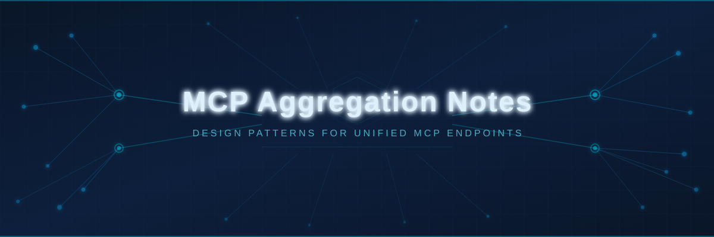
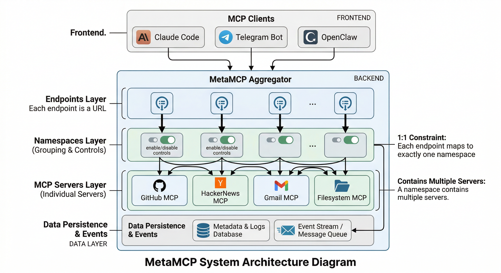
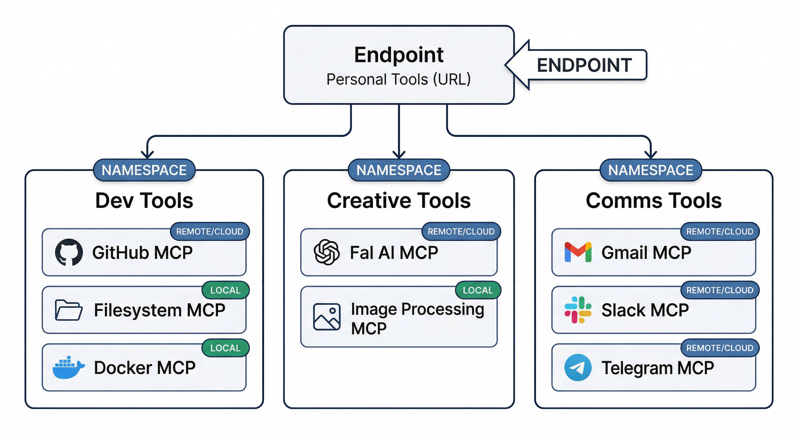
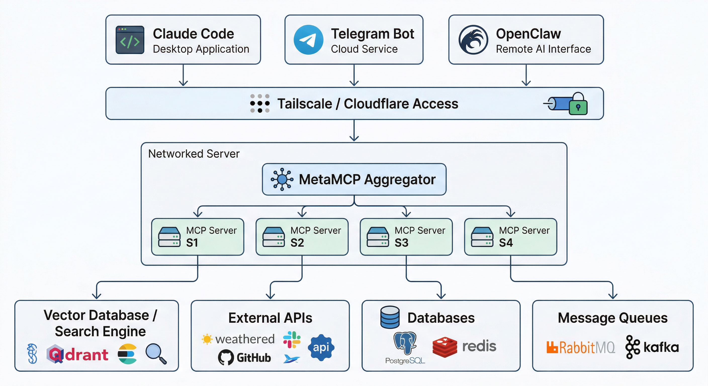
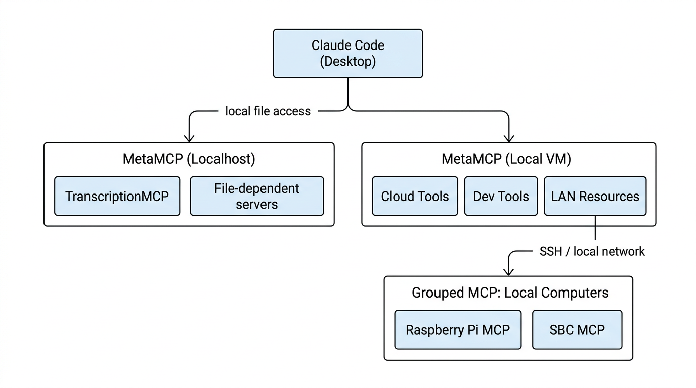

# MCP Aggregation Notes

Notes on how MCP aggregation tools organize and expose MCP servers, design friction in current architectures, and what the ideal aggregation model would look like.

---

## Table of Contents

- [MetaMCP Hierarchy](#metamcp-hierarchy)
- [Design Friction: 1:1 Endpoint-to-Namespace Constraint](#design-friction-the-11-endpoint-to-namespace-constraint)
- [Deployment Topology](#deployment-topology)
- [Ecosystem Research](#ecosystem-research)

---

## MetaMCP Hierarchy

MetaMCP uses a three-level hierarchy for aggregating MCP servers:

```
Servers → Namespaces → Endpoints
```

### MCP Servers

The base unit. Each server is an individual MCP server configuration (e.g., a HackerNews server running `uvx mcp-hn`, a GitHub server, etc.).

### Namespaces

Namespaces group one or more MCP servers together. This is the organizational layer where you:

- Enable/disable individual servers or specific tools within those servers
- Apply middleware (e.g., filtering inactive tools)
- Override tool names, descriptions, and annotations

A namespace defines a curated set of tools drawn from its member servers.

### Endpoints

Endpoints are the public-facing URLs that clients connect to. Each endpoint:

- Is assigned exactly **one namespace**
- Exposes that namespace's tools via SSE, Streamable HTTP, or OpenAPI transports
- Can support auth via API key or OAuth (MCP Spec 2025-06-18)

You can one-click switch which namespace an endpoint uses. Multiple endpoints can point to different namespaces, letting you expose different tool sets to different clients.

### Visual Summary



---

## Design Friction: The 1:1 Endpoint-to-Namespace Constraint

### The Problem

The current MetaMCP design enforces a strict **1:1 mapping between endpoints and namespaces**. This creates friction when you need to organize servers along multiple dimensions simultaneously.

In practice, there are at least two natural organizing dimensions for MCP servers:

1. **Context** — *Who is this for?* (e.g., Personal vs Work)
2. **Tool Cluster** — *What kind of tools are these?* (e.g., Dev, Creative, Comms, Analytics)

A third dimension, **Accessing Tool** (which client is connecting — Claude Code, a Telegram bot, OpenClaw, etc.), is also relevant but is more of a federation concern.

### What You'd Want

An endpoint should represent a **context** (Personal, Work), and multiple namespaces representing **tool clusters** should be assignable under it:



This would allow you to maintain logical grouping of tool clusters while exposing them all under a single context-based endpoint.

### What You're Forced to Do Instead

Because of the 1:1 constraint, you must choose one of two compromises:

| Approach | Tradeoff |
|----------|----------|
| **One mega-namespace per context** (e.g., "Personal" namespace with all servers) | Loses tool cluster organization; everything is flat |
| **One endpoint per cluster** (e.g., separate endpoints for "Personal-Dev", "Personal-Creative") | Loses the context grouping; the accessing tool must be configured with multiple endpoints |

Neither preserves both dimensions.

### Proposed Hierarchy (1:Many Endpoint-to-Namespace)

A more flexible design would support:

```
Servers → Namespaces (tool clusters) → Endpoints (contexts)
                                         ↑
                                   1:many relationship
```

With dynamic tool exposure becoming more common, this would let a single endpoint expose a rich, organized set of tools while keeping the cluster-level controls (enable/disable, middleware, overrides) that namespaces provide.

### The Accessing Tool Dimension

The accessing tool (Claude Code, Telegram bot, OpenClaw, etc.) is a separate concern from context and clustering. It could be addressed through:

- **Endpoint-level auth/filtering** — different API keys per client, with tool visibility rules
- **A dedicated "client profile" entity** — that maps which namespaces a given client can see within an endpoint
- **Federation** — where each accessing tool connects to its own aggregator that federates from a shared pool of namespaces

This dimension is orthogonal to the context/cluster hierarchy and would ideally be layered on top rather than shoehorned into the namespace model.

---

## Deployment Topology

### Current State: Split Aggregators

In practice, the current deployment uses **two MetaMCP instances**:

1. **Localhost (desktop/workstation)** — for MCP servers that need local file access (e.g., TranscriptionMCP that requires a binary file path)
2. **Ubuntu VM (local server)** — for everything else

This split exists not by design choice but by necessity: some MCP servers don't have a clean way to pass in binary files or local resources over the network. If the server expects a local file path, it has to run where the file lives.

### Ideal State: Single Networked Aggregator

The preferred architecture would consolidate **all MCP servers onto a single networked resource** (local server or cloud), accessible from any client via Tailscale or Cloudflare Access:



This gives every client — local or remote — the same set of tools through a single aggregation point.

### Blocker: Local File Access

The main obstacle to full consolidation is MCP servers that require **local file system access** on the client machine. Until there's a standardized way for MCP servers to handle file transfer (e.g., streaming binary content over the MCP protocol rather than expecting a local path), some servers will be forced to run co-located with the files they need to process.

Possible mitigations:
- **Shared network storage** (NFS/SMB) mounted on both client and server
- **An MCP file-relay server** that uploads files to a staging area accessible to the networked aggregator
- **Protocol-level file transfer** — the MCP spec could support binary content passing alongside tool calls, removing the local path dependency entirely

### Multi-Level Aggregation (Nested Bundling)

Aggregation tools like MetaMCP typically assume a single flat level of bundling: servers go into one aggregator, and that's it. In practice, a more useful pattern is **nested aggregation** — aggregators that themselves consume other aggregators, creating a tree of MCP access.

#### Current Approach

Rather than registering every individual server into one MetaMCP instance, local device clusters (e.g., Raspberry Pis, SBCs) get their own grouped MCP server first. That grouped server then connects into the main MetaMCP aggregator on the local VM. The result is a multi-hop chain:



A client hitting the top-level MetaMCP discovers LAN resources, which in turn route to the Raspberry Pi's MCP server. The client doesn't need to know about the multi-hop path — it just sees the tools.

#### Why This Matters

- **Locality** — Device-level MCPs run where they need to (on or near the hardware they manage)
- **Composability** — Each level of aggregation is independently manageable; you can swap out the Pi cluster without touching the top-level config
- **Scalability** — Adding a new device means adding it to the local cluster MCP, not reconfiguring every aggregator above it
- **Discoverability** — The tree structure means clients don't need upfront knowledge of every endpoint; they discover capabilities through the aggregation chain

This is effectively a **federation pattern** applied to MCP — not just flat bundling, but hierarchical routing of tool access across network boundaries.

---

## Ecosystem Research

The research below surveys the MCP aggregator/gateway landscape as of Q1 2026 and evaluates how each tool maps to the target architecture described in this repo.

**[Full Research Note: MCP Aggregation, Gateway, and Proxy Tools — State of the Ecosystem (Q1 2026)](research/mcp-aggregator-landscape-q1-2026.md)**

### Key Findings

**No tool fully satisfies all target requirements.** The ecosystem has converged on flat aggregation with RBAC, which addresses enterprise governance but not the multi-dimensional organization model described here.

| Tool | Closest to Target? | Key Strength | Key Gap |
|------|---|---|---|
| **MetaMCP** | Hierarchy model matches | Three-level S/N/E hierarchy, tool overrides | 1:1 endpoint-to-namespace, no federation |
| **IBM ContextForge** | Best overall candidate | Federation via mDNS, virtual servers, broadest transport support | 1:many mapping unverified |
| **Bifrost** | Client dimension | Virtual keys with per-key tool allow-lists | No hierarchy, no federation |
| **MCP Mesh** | Conceptual primitives | Virtual MCPs, multi-level RBAC | No federation, sparse docs |
| **agentgateway** | Governance/compliance | Linux Foundation backing, CEL policy engine, v1.0 maturity | No namespace hierarchy |
| **Cloudflare Portals** | Zero Trust auth | Managed, per-server Access policies | No self-hosting, no namespaces |
| **Microsoft Gateway** | Enterprise K8s | RBAC, control/data plane split | Overkill for single-server, no namespaces |

### Recommended Investigation Path

1. **IBM ContextForge** — verify whether virtual servers support 1:many composition under a single endpoint and whether federation enables true nested aggregation
2. **MetaMCP** — monitor for 1:many endpoint-to-namespace support (maintainers are aware of the limitation)
3. **Hybrid approach** — MetaMCP for namespace/endpoint management + manual federation by registering one MetaMCP endpoint as a server in another instance (works today, no first-class support)
